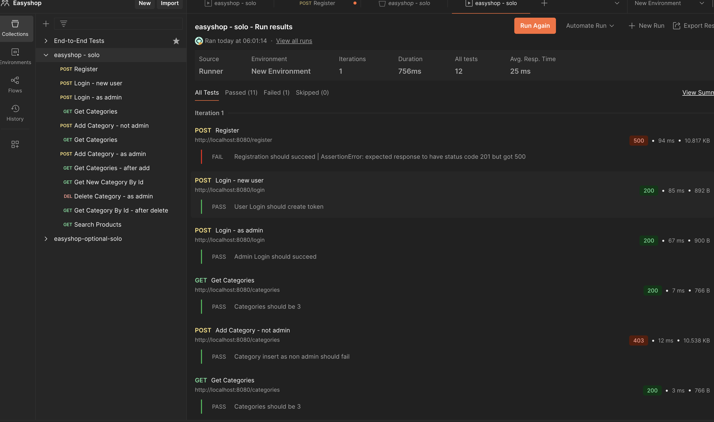

# 🛍️ EasyShop E-Commerce Platform

**Welcome to the EasyShop Application!**

EasyShop is a backend e-commerce application built using **Java** and **Spring Boot**, with **MySQL** as the database. It supports full **CRUD operations** for products, users, and shopping cart management. The application uses **JDBC** for database interaction and **Postman** for API testing.

---

## 🚀 Features

- ✅ **User Authentication** with JWT (Register, Login, Role-Based Access)
- 🛒 **Product Browsing** with category, price, and color filters
- 📦 **Shopping Cart** per logged-in user
- 🔐 **Role-Based Authorization** (`ROLE_USER`, `ROLE_ADMIN`)
- 🧑‍💼 Admin-only category management
- 📡 RESTful API with Spring Boot
- 🧪 End-to-End tested using Postman

---

## 🖥️ Screenshots

### ✅ Frontend - Product Catalog UI


### ✅ API Test Results (Postman)



---

## ⚙️ Tech Stack

| Layer         | Technology                  |
|--------------|-----------------------------|
| Backend       | Spring Boot (Java)         |
| Database      | MySQL                      |
| Security      | Spring Security + JWT      |
| REST Client   | Postman                    |
| Frontend UI   | HTML / CSS (static template) |
| Build Tool    | Maven                      |

---

## 📁 Folder Structure

```
src/main/java/org/yearup/
├── controllers/
├── data/
├── models/
├── security/
└── EasyshopApplication.java
```

---

## 📦 How to Run

### ✅ Prerequisites

- Java 17+
- Maven
- MySQL 8+
- Postman (optional)

### ✅ Setup Steps

1. **Clone the Repo**
   ```bash
   git clone https://github.com/kridwan99/easyshop-springboot.git
   cd easyshop-springboot
   ```

2. **Create MySQL Database**
   ```sql
   CREATE DATABASE easyshop;
   ```

3. **Update `application.properties`**
   ```properties
   spring.datasource.url=jdbc:mysql://localhost:3306/easyshop
   spring.datasource.username=your_mysql_user
   spring.datasource.password=your_mysql_password
   ```

4. **Run the App**
   ```bash
   ./mvnw spring-boot:run
   ```

5. **Test APIs**
    - `POST /register`
    - `POST /login`
    - `GET /products`
    - `GET /categories`

---

## 🔐 Roles and Permissions

| Endpoint                     | Role       | Description                      |
|-----------------------------|------------|----------------------------------|
| `/register`, `/login`       | Public     | Register or login                |
| `/categories` (GET)         | All users  | View categories                  |
| `/categories` (POST/DEL)    | Admin only | Manage categories                |
| `/cart`                     | Authenticated users | Shopping cart operations |

---

## 🧪 Postman Test Summary

- ✅ Login tests pass (admin + user)
- ✅ Category protected routes work


---

## 🛠️ Future Improvements

- Add product management for admins
- Connect to frontend using React or Angular
- Add checkout and order history features
- Docker support for deployment

---

### 👤 Author
#### Ridwan Kadar


